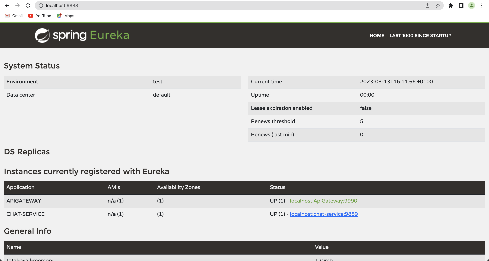
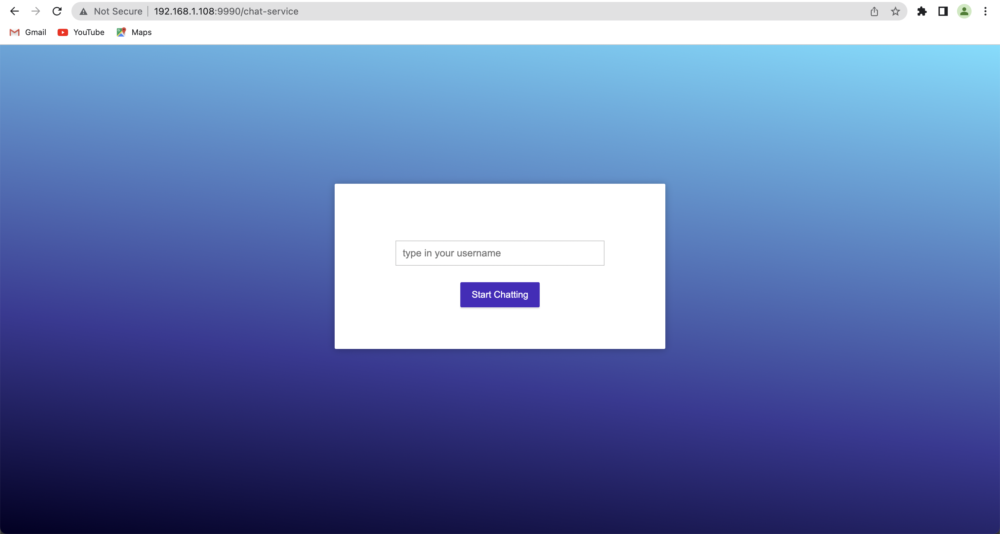
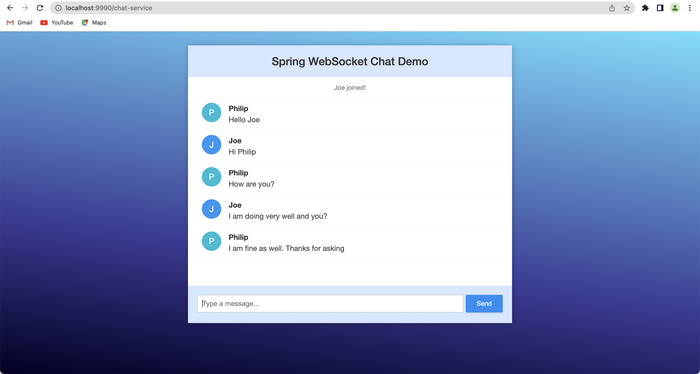

## Spring Boot WebSocket MicroService Chat Appplication
WEBSOCKET: Websocket protocol is one of the ways to make your application handle real-time messages.

STOMP:  Stomp is an acronym for Simple Text Oriented Messaging Protocol, for interacting with any STOMP message broker. 
It defines a handful of frame types that are mapped onto WebSockets frames, e.g., CONNECT, SUBSCRIBE, UNSUBSCRIBE, ACK, or SEND. On one hand, these commands are very handy to manage communication while, on the other, they allow us to implement solutions with more sophisticated features like message acknowledgment.

## Requirements

1. Java - 11
2. Maven - 3.x.x
3. Spring Boot Cloud and Dependencies

## Services
1. Eureka Server running on http://localhost:9888/ 
2. Gateway Service running on http://localhost:9990/
3. Chat Service running on http://localhost:9889/

## Steps to Setup

**1. STEP ONE: Clone the application**

```bash
git clone https://github.com/joenan/chat-app.git
```

**2. Build and run the app using maven**

**STEP TWO: Start the Eureka server**
```bash
cd chat-app/server
mvn spring-boot:run
```
**STEP THREE: Start the Gateway Service**
```bash
cd chat-app/gateway-service
mvn spring-boot:run
```
**STEP FOUR: Start the Chat Service**
```bash
cd chat-app/chat-service
mvn spring-boot:run
```

### When all services are started,
#### you can visit eureker server admin on your browser through http://localhost:9888/ and you will see as shown in the screenshot below



#### To open the chat-application, you will visit http://localhost:9990/chat-service on your browser and you will see the application as shown on the screenshot below




